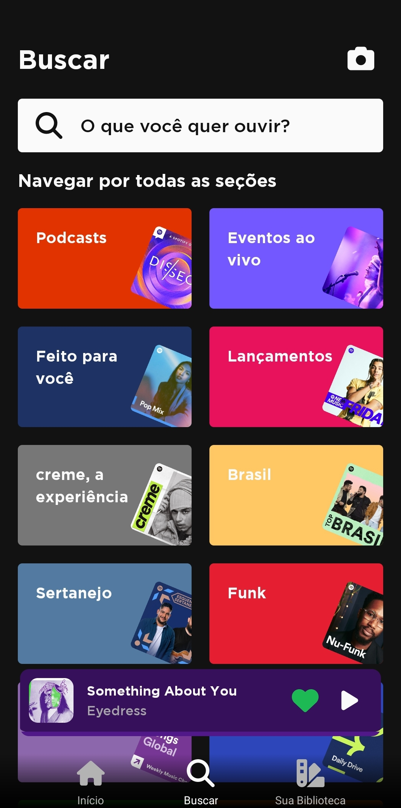

# spotify-clone

## Sumário

- [spotify-clone](#spotify-clone)
  - [Sumário](#sumário)
  - [*To-do list*](#to-do-list)
  - [Motivação](#motivação)
  - [Pilha de tecnologia](#pilha-de-tecnologia)
  - [Galeria](#galeria)
  - [Como rodar](#como-rodar)
    - [Pré-requisitos](#pré-requisitos)
    - [Passo a passo](#passo-a-passo)

## *To-do list*

- [X] Mudar a paleta de cores
- [X] Remover `expo-blur`
- [X] Componentizar `Mix` e `Artist`
- [X] Transformar todas as partes repetitivas do código-fonte em componentes
- [X] Verificar se é viável adicionar um degradê com `zIndex` no navegador de abas inferiores
- [X] Fazer com que o componente `TagGroup` seja fixo somente ao rolar a tela para baixo
- [X] Adicionar a tela de pesquisa e seções
- [X] Adicionar a tela da biblioteca
- [X] Comentar sobre a constante `disableFixedGroupHeightFeature` e web scraping no README.md
- [X] Adicionar contexto de usuário para o nome ~~e a música que está sendo tocada~~
- [ ] Substituir as mídias padrão do diretório `assets/`
- [ ] Criar a barra de progresso do componente `Player`
- [ ] Verificar se é viável animar o componente `TagGroup` 

## Motivação

Este aplicativo é um clone simples do Spotify, projetado para simular, de forma básica, a experiência do aplicativo original.

O objetivo principal deste clone é oferecer uma interface minimalista que permita aos usuários explorar as principais seções do aplicativo, como a página inicial, listas de reprodução, artistas e álbuns. Embora não contenha recursos avançados ou funcionalidades completas, ele fornece uma visão geral do design e da estrutura do aplicativo original do Spotify.

Vale ressaltar que esse clone não possui acesso à API oficial do Spotify. Por esse motivo, não é capaz de reproduzir músicas em tempo real ou fornecer conteúdo dinâmico. O aplicativo foi desenvolvido com base em web scraping do site do Spotify, o que significa que ele contém mídias fielmente replicadas do app original.

Observação: No arquivo [`Home/index.tsx`](./src/screens/Home/index.tsx), você encontrará uma constante chamada `disableFixedGroupHeightFeature` que permite habilitar ou desabilitar uma funcionalidade. Essa funcionalidade foi criada como uma resposta à especificação do mockup, mas não ficou esteticamente agradável. Ela oferece a opção de priorizar a aderência estrita à especificação, mesmo que isso possa impactar a estética do design.

Este foi o primeiro repositório de código apresentado no [Curso Superior de TSI](https://www.ifms.edu.br/campi/campus-aquidauana/cursos/graduacao/sistemas-para-internet/sistemas-para-internet) do IFMS como requisito para obtenção da nota parcial das atividades da unidade curricular Programação para Dispositivos Móveis II.

| [Próximo repositório &rarr;](https://github.com/mdccg/muzy-simple-calc) |
|-|

## Pilha de tecnologia

| Papel | Tecnologia |
|-|-|
| Biblioteca de interface de usuário | [React Native](https://reactnative.dev/) |
| Bundler | [Expo](https://expo.dev/) | 
| Linguagem de programação | [TypeScript](https://www.typescriptlang.org/) |

Os créditos pelas mídias disponibilizadas estão disponíveis [aqui](./assets/README.md).

## Galeria





## Como rodar

### Pré-requisitos

- [Node](https://nodejs.org/en/download/);
- [Yarn](https://yarnpkg.com/) (opcional);
- Dispositivo móvel:
  - [Expo Go](https://expo.dev/client).

### Passo a passo

1. Clone o repositório de código em sua máquina;
   
2. Abra um shell de comando de sua preferência (prompt de comando, PowerShell, terminal _etc_.);
   
3. Instale as dependências do projeto através do seguinte comando:

```console
$ npm install
```

Caso esteja utilizando o gerenciador de pacotes Yarn, execute o seguinte comando como alternativa:

```console
$ yarn
```

4. Execute o seguinte comando para iniciar o app:

Para npm:

```console
$ npm run start
```

Para Yarn:

```console
$ yarn start
```

5. Uma vez iniciado, aparecerá um QR Code. Você deve escaneá-lo com o aplicativo [Expo Go](https://expo.dev/client), disponível para Android e iOS;

6. Como alternativa, você pode executar o app no seu navegador, pressionando o atalho `w`. Entretanto, alguns módulos podem não funcionar na versão web do app.
